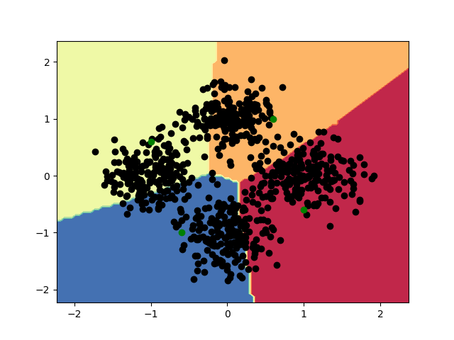
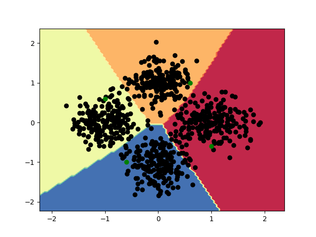

# 可视化实验

### SelfTraining 算法
下图中，黑色点表示无标签样本点，绿色点表示带标签样本点。直接使用少量带标签数据训练，结果如下图，分类面处于四个绿色点的中间区域

使用无标签数据后，分类决策面如下图，分类面处于无标签样本点稀疏的区域。这个结果符合半监督学习的一个初衷：希望分类面穿越样本稀疏的区域。

如果想用 Self Training 算法改进某一个类别的分类结果，必须保证这个类别分对的样本数大于被误分的样本数，这样最小化Loss的过程中，分类面会被大多数样本点推着走，最终停留在样本稀疏的区域（此时分类面左右双方无标签样本点的推力均衡）。
